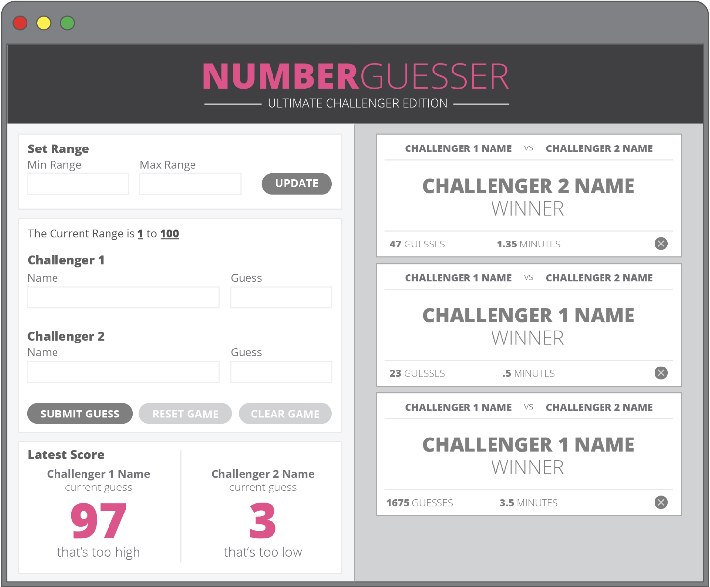
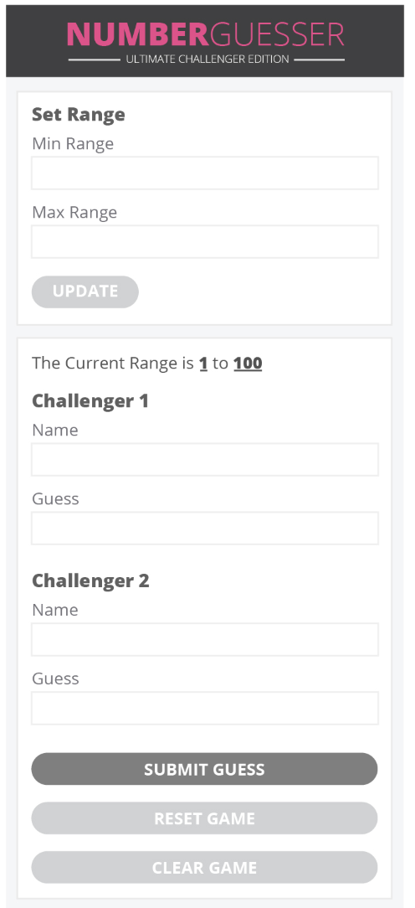
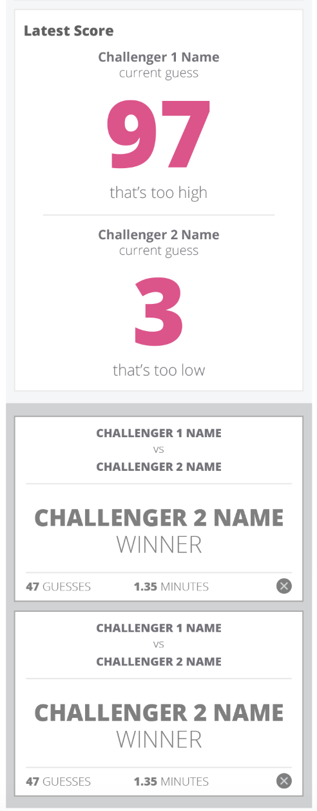

# NumberGuesser
## Overview

Number Guesser is a game of chance where two players guess a randomly generated number. If they'd like to add or reduce the difficulty they can set a custom range of their own. The website helps each player by displaying their current guess as well as comparing it to the random number and giving them a hint as to if it is too high or too low. If a player tried to create an invalid range, leave a guess blank, or submit a guess, the game will advise them of their mistake and show where their error was made.

## Technical

This site was built using HTML, CSS, and vanilla JavaScript.

## Wins

Some wins during this project included refactoring two long, complex functions into one more dynamic function as well as refactoring one very large function into three smaller, better executed function. We also had a great workflow together along with our use of Git and Github. We were able to use both effectively which minimized our code loss and increased productivity.

## Struggles

One struggle was attempting to refactor two large functions into one more dynamic function. It didn't end up working and actually caused us to lose nearly 50% of our functionality which was difficult to reverse and caused a large loss in productivity. Another struggle was achieving a smooth, responsive layout at multiple screen sizes with minimal media queries, but we achieved satisfactory results with three.

 

 
Here is our website:

 
This is our mobile layout. 

